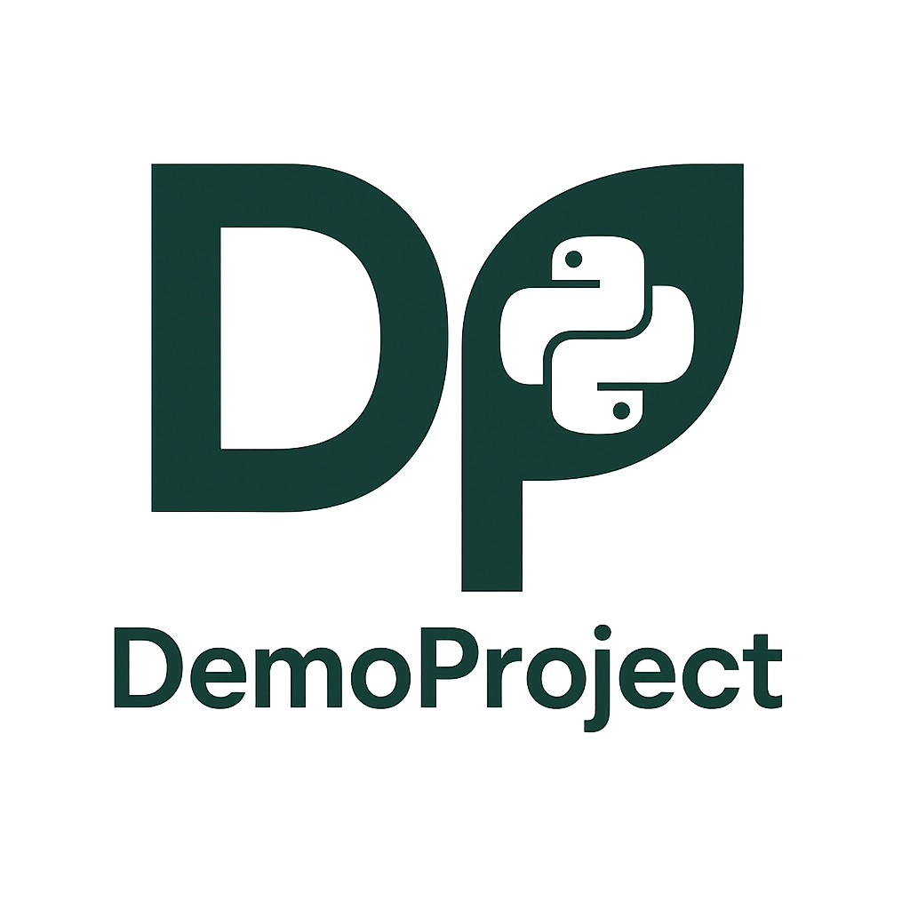
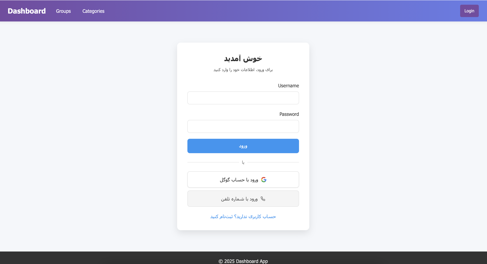

# Demo Project

<p align="center">
  
</p>

<div align="center">
  
  
  
  [](CONTRIBUTING.md)
  
  </img> </img>


</div>

> A comprehensive Django-based survey and assessment management system for creating hierarchical groups, categories, and subcategories to organize questions and collect responses.



## 🚀 Overview

The **Survey Management System** is designed to help organizations build flexible, hierarchical survey structures and gather insights efficiently. This demo project showcases best practices in Django application design, authentication, API integration, and user-friendly dashboards.

---

## 🎯 Key Features

* **User Authentication**

  * Custom user model supporting email and phone number
  * Social login via Google OAuth (django-allauth)
  * Phone verification with SMS (Kavenegar API)

* **Upload Center**
  * Upload center for images and media files
  * Secure storage and management of uploaded content
  * Store images, documents, and other media
  * Easy access to uploaded content in forms and responses

* **Hierarchical Organization**

  * Define groups with parent–child relationships
  * Organize content into categories and nested subcategories
  * Adaptable structure for quizzes, polls, and assessments

* **Response Collection**

  * Record and store user answers to various question types
  * Filter and track responses by user, group, category, and subcategory
  * Exportable data for reporting and analysis

* **Dashboard Interface**

  * Intuitive UI for browsing hierarchy and managing content
  * Dynamic forms for submitting survey responses
  * Admin views for bulk operations and content moderation

---

## 🛠 Technologies Used

| Layer              | Tools & Libraries                             |
| ------------------ |-----------------------------------------------|
| **Backend**        | Django 5.2.1, Python 3.x, PostgreSQL          |
| **Authentication** | django-allauth, custom phone auth             |
| **Frontend**       | Django Templates, HTML5, CSS3, JavaScript     |
| **APIs**           | Google OAuth REST API, Kavenegar SMS API<br/> |

---

## ⚙️ Installation

1. **Clone the repository**

   ```bash
   git clone https://github.com/ihoooman/demoproject.git
   cd survey-management-system
   ```
2. **Set up a virtual environment**

   ```bash
   python3 -m venv venv
   source venv/bin/activate
   ```
3. **Install dependencies**

   ```bash
   pip install -r requirements.txt
   ```
4. **Configure environment variables**

   * Copy `.env.example` to `.env` and update keys:

     ```env
     SECRET_KEY=your_secret_key
     KAVENEGAR_API_KEY=your_api_key
     LOWERCASE_DOMAIN=yourdomain.com
     ```
5. **Apply database migrations**

   ```bash
   python manage.py migrate
   ```
6. **Create a superuser** (optional)

   ```bash
   python manage.py createsuperuser
   ```
7. **Start the development server**

   ```bash
   python manage.py runserver
   ```
8. **Visit** `http://127.0.0.1:8000/` in your browser.

---

## 🐳 Docker Deployment

You can also run this application using Docker, which simplifies the setup process and ensures consistency across different environments.

### Using Docker

1. **Build and run with Docker**

   ```bash
   # Build the Docker image
   docker build -t survey-management-system .

   # Run the container
   docker run -p 8000:8000 survey-management-system
   ```

2. **Using Docker Compose** (recommended)

   ```bash
   # Start all services
   docker-compose up

   # Run in detached mode
   docker-compose up -d

   # Stop all services
   docker-compose down
   ```

3. **Access the application**

   Visit `http://localhost:8000` in your browser.

### Environment Variables

When using Docker, you can configure the application by setting environment variables in the `docker-compose.yml` file or by passing them to the `docker run` command:

```bash
docker run -p 8000:8000 \
  -e DEBUG=False \
  -e SECRET_KEY=your_secret_key \
  -e ALLOWED_HOSTS=yourdomain.com,www.yourdomain.com \
  survey-management-system
```

---

## 🔧 Configuration

### Google OAuth

1. Create a project in the [Google Cloud Console](https://console.developers.google.com/).
2. Enable **Google+ API** and generate OAuth credentials.
3. Add your application domain to **Authorized domains**.
4. Update `SOCIALACCOUNT_PROVIDERS` in `settings.py`:

   ```python
   SOCIALACCOUNT_PROVIDERS = {
       'google': {
           'APP': {
               'client_id': 'YOUR_CLIENT_ID',
               'secret': 'YOUR_CLIENT_SECRET',
           }
       }
   }
   ```

### Kavenegar SMS API

1. Sign up at [Kavenegar](https://kavenegar.com/) and obtain an API key.
2. Set `KAVENEGAR_API_KEY` and `KAVENEGAR_SENDER` in `.env`:

   ```env
   KAVENEGAR_API_KEY=your_api_key
   KAVENEGAR_SENDER=your_sender_number
   ```

---
## 🚀 Deployment
This application is deployed on Railway with continuous deployment set up via GitHub Actions.

Live Demo: 
   ```
https://demoproject-production-6b92.up.railway.app
   ```
The deployment workflow automatically triggers a rebuild on Render when changes are pushed to the main branch.


---


## 📂 Project Structure

```plaintext
survey-management-system/
├── LICENSE
├── README.md
├── requirements.txt
├── .env.example
├── manage.py
├── .gitignore
├── project/
│   ├── settings.py
│   ├── urls.py
│   └── wsgi.py
├── accounts/
│   ├── models.py
│   ├── views.py
│   └── tests.py
├── dashboard/
│   ├── models.py
│   ├── views.py
│   ├── forms.py
│   ├── tests.py
│   └── templates/
│       └── dashboard/
│           ├── group_list.html
│           └── subcategory_list.html
├── login/
│   └── utils.py
└── screenshots/
    └── demo.png
  ```
---

## 🤝 Contributing

Contributions are welcome! Please:

1. Fork the repo
2. Create a branch: `git checkout -b feature/YourFeature`
3. Commit: `git commit -m "Add YourFeature"`
4. Push: `git push origin feature/YourFeature`
5. Open a Pull Request

---

## 📄 License

This project is licensed under the **MIT License**. See [LICENSE](LICENSE) for details.

---

## 🙋‍♂️ Contact & Showcase

* **GitHub**: [github.com/ihoooman](https://github.com/ihoooman)
* **LinkedIn**: [linkedin.com/in/hoomanmdd](https://linkedin.com/in/hoomanmdd)

Feel free to explore, review, or connect!
